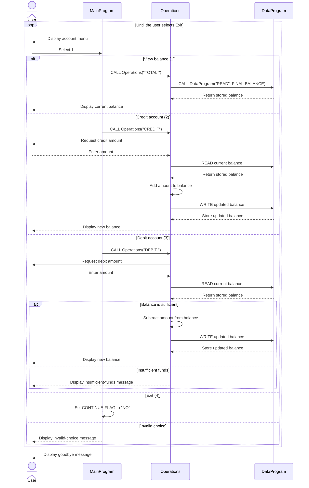

# School Accounting System

This directory documents the current COBOL accounting prototype. The program models a single school account balance and supports balance inquiries, credits, and debits.

## COBOL Files

### `src/cobol/main.cob`

`MainProgram` is the entry point and interactive menu controller. It:

- Displays the account-management menu.
- Accepts a user choice from 1 through 4.
- Calls `Operations` with the requested operation.
- Repeats until the user selects Exit.

The menu represents the front end of a school finance-office terminal or cashier workflow.

### `src/cobol/operations.cob`

`Operations` contains the accounting rules and transaction workflow. Its main callable operations are:

- `TOTAL `: Reads and displays the current balance.
- `CREDIT`: Accepts an amount, adds it to the balance, saves the result, and displays the new balance.
- `DEBIT `: Accepts an amount, verifies that the balance is sufficient, subtracts it, saves the result, and displays the new balance.

It calls `DataProgram` to read and write the balance rather than modifying the storage value directly.

### `src/cobol/data.cob`

`DataProgram` is the balance-storage module. It exposes two operations through its linkage parameters:

- `READ`: Copies the stored balance into the caller's balance field.
- `WRITE`: Replaces the stored balance with the caller's balance field.

The initial balance is `1000.00`. The value is held in working storage, so it is not persistent and resets when the program starts again.

## Current Business Rules

1. The system operates on one account balance; it does not identify a student or maintain multiple student accounts.
2. A new run starts with a balance of `1000.00`.
3. A credit increases the balance by the entered amount.
4. A debit is allowed only when the current balance is greater than or equal to the requested amount.
5. An overdrawn debit is rejected with an insufficient-funds message, and the balance is left unchanged.
6. A balance inquiry does not change the balance.
7. The user can exit from the main menu; invalid menu choices are rejected and the menu is shown again.
8. Amounts are represented as numeric values with two decimal places.

## Student-Account Requirements Not Yet Implemented

For use in a real school accounting system, the prototype would need additional business rules and data, including:

- A student identifier and a separate balance for each student.
- Student enrollment and account-status validation.
- Tuition, fees, discounts, scholarships, financial aid, refunds, and payment types.
- Transaction dates, references, descriptions, and an auditable transaction history.
- Validation that amounts are positive and within accepted limits.
- Persistent storage and recovery after a restart.
- Authorization and separation of duties for staff who post or reverse transactions.
- Reports for student statements, outstanding balances, daily receipts, and reconciliation.

These requirements are documentation gaps rather than behavior currently present in the COBOL source.

## Application Data Flow

The sequence below shows how a user request flows through the menu, accounting operations, and balance storage.

